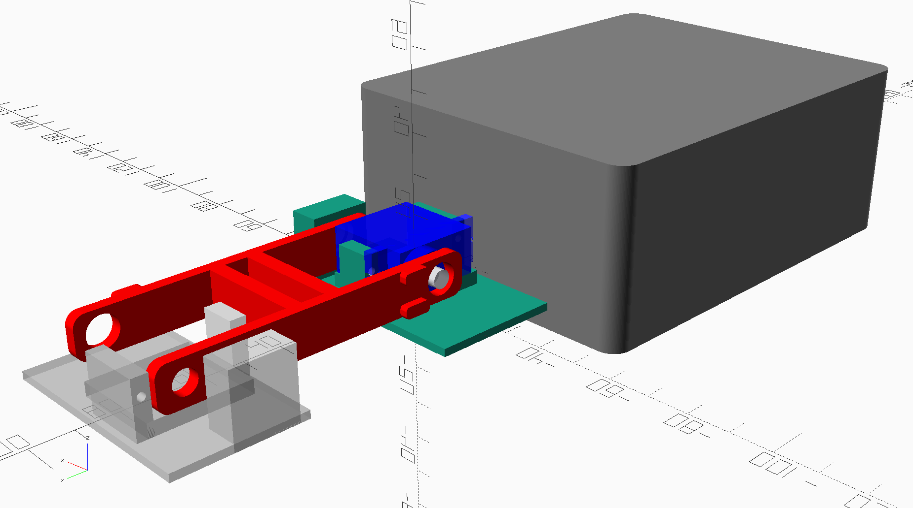
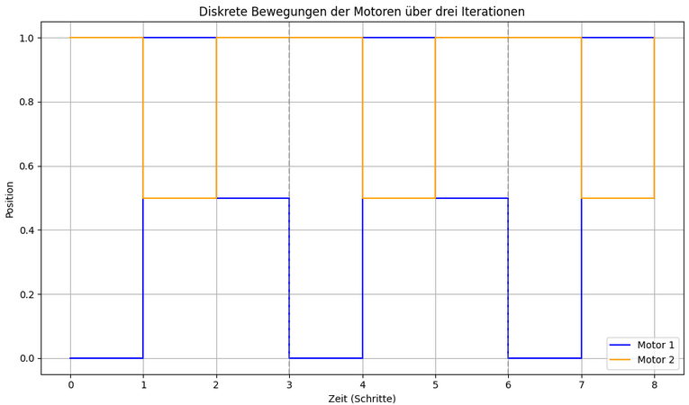
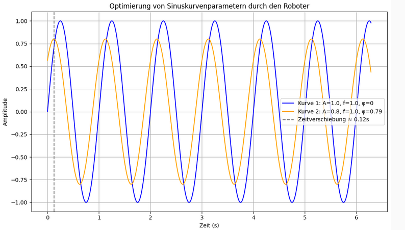
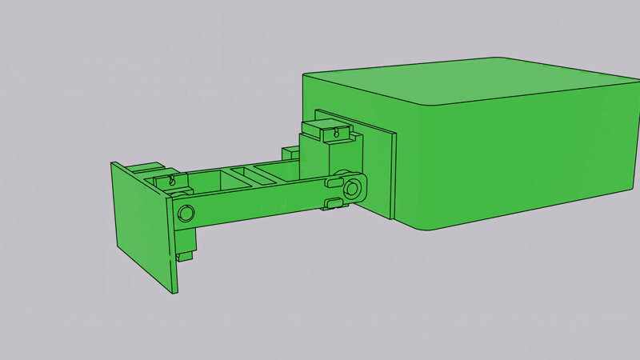

# BMFH - selbstlernender Roboter

Code für den Unterricht im Rahmen des [BMFH](https://www.bmfh.ch/) 2025. Wir programmieren einen elementaren Sensor-Aktor-Roboter. Er besteht aus einem Sensor (XYZ-Lagesensor) und zwei Aktoren (Servo-Motoren).  

## Kennenlernen der Steuerung

Wir steuern den Roboter mit Hilfen der [Arduino IDE](https://arduino.cc). Wenn er einmal programmiert ist, kann er mit dem Batterieblock autonom arbeiten. Zu Beginn geben wir ihm fixe Positionen vor, die er ansteuern soll. Mit so einem Ablauf kommen wir schon ziemlich schnell vorwärts. [Dieses Skript bildet die Basis](./kontinuierlich/kontinuierlich.ino).

## Lernen anhand der Positionen

Statt die Positionen von Hand festzulegen, lassen wir den Rechner mit Hilfe des Sensors herausfinden, ob er sich vorwärtsbewegt. Er lernt so, seine Bewegung selber zu optimieren. [Dieses Skript bildet die Basis](./selbstlernende/selbstlernende.ino).

## Flüssigere Bewegungen

Wir wechseln von den fixen Positionen zu Sinuskurven. Durch Optimierung der Kurvengeometrie und der synchronen Abhängigkeit der beiden Motoren kommen wir schneller vorwärts.  [Dieses Skript bildet die Basis](./sinus/sinus.ino).

## Lernen der Sinuskurven

Analog des Positionenlernens können wir mit unserem Setup auch die Kurven und deren Abhängigkeiten optimieren lassen. Wir erarbeiten uns das Skript selber.

## Erweitertes, intelligenteres Lernen

Statt im zufälligen Raum, lassen wir den Algorithmus in der Nähe eines optimierten Wertesets nach besseren Möglichkeiten suchen. So können wir auf bereits Erlerntem aufbauen und uns weiterentwickeln. Wir erarbeiten uns das Skript selber, beginnend vom kontinierlichen oder vom sinoidalen Ansatz aus.

